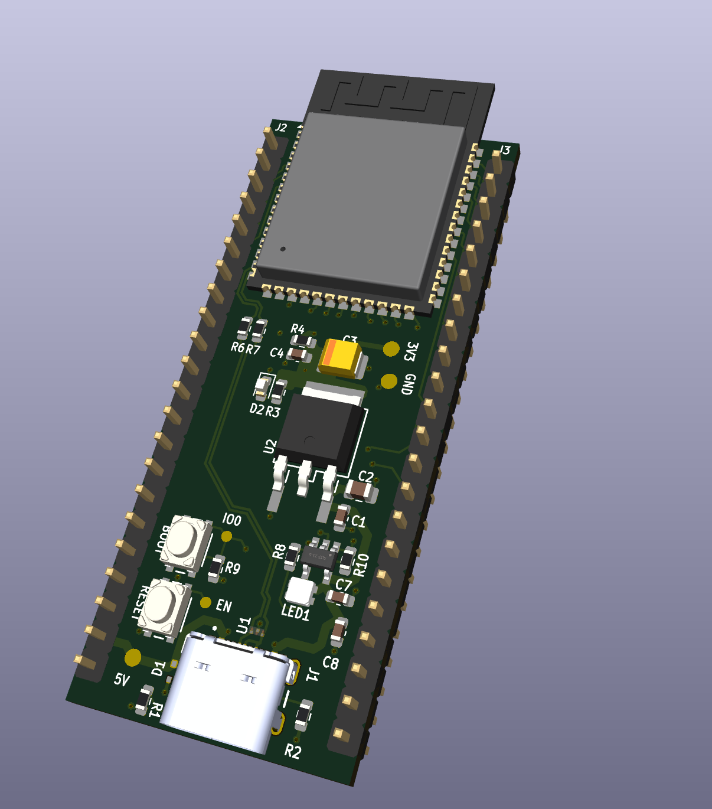
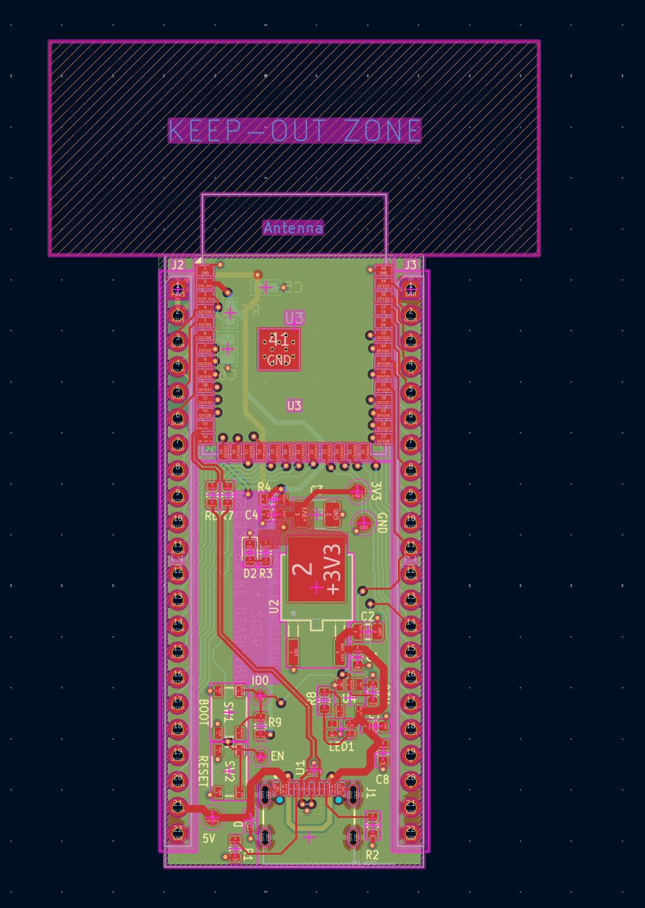
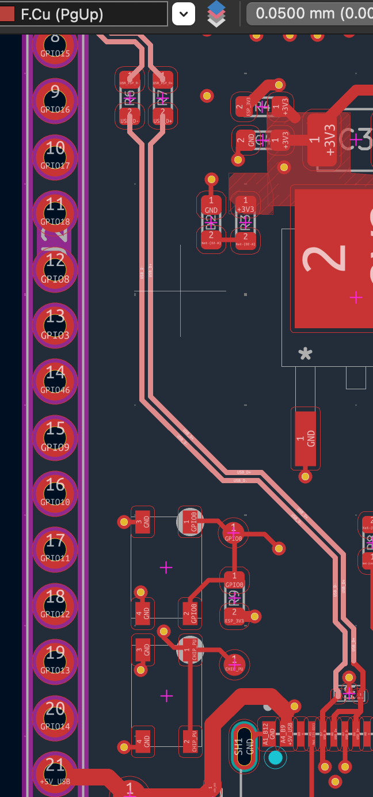

# ESP32-S3 4-Layer RF Development Board

This project is a custom 4-layer development board built around the ESP32-S3. I designed the board to expand my PCB design experience into an RF-aware layout, multi-layer stackup design, controlled-impedance USB routing, and manufacturing preparation.

My board include native USB-C programming and power, 5 V-to-3.3 V regulation, GPIO breakout headers, BOOT and RESET controls, protection circuitry, test points, and a programmable RGB status LED.



*KiCad-generated 3D render of the ESP32-S3 development board.*

---

## Project Overview

The ESP32-S3 module provides Wi-Fi and Bluetooth connectivity using its integrated PCB antenna. The board exposes the ESP32-S3 GPIO through two headers while providing the supporting power, USB, programming, reset, and protection circuitry needed for standalone development.

A 4-layer PCB stackup was used to provide dedicated ground and power planes while maintaining short return paths and supporting controlled-impedance routing for the native USB interface.

---

## Details

- **MCU:** ESP32-S3 [LINK]
- **PCB:** 4-layer, 1.6 mm
- **USB:** USB-C with native ESP32-S3 USB programming[LINK]
- **USB Routing:** 90 Ω differential impedance target for D+/D−
- **Power Input:** 5V USB
- **Regulation:** 5V to 3.3V using LD1117S33 [LINK]
- **GPIO:** Dual breakout headers
- **Controls:** BOOT/RESET pushbuttons [LINK]
- **Protection:** USB ESD protection [LINK]
- **Status:** Programmable RGB LED [LINK]
- **Debugging:** Dedicated test points for important power and signal nets for debugging/checking

---

## PCB Stackup

The board uses a 4-layer stackup:
- **L1/F.Cu:** Components and signals
- **L2/In1.Cu:** Solid GND
- **L3/In2.Cu:** 3.3 V power 
- **L4/B.Cu:** Secondary signal routing

The stackup was configured around the intended JLCPCB manufacturing process rather than using KiCad's default layer construction.

---

## PCB Design Highlights [FIX!!!]




*Top PCB layout showing component placement and routed signals.*

---

## USB Differential Pair

The ESP32-S3 native USB interface was one of the primary high-speed layout considerations for this project.

The D+ and D− pair was routed using dimensions calculated for the selected 4-layer manufacturing stackup:

- **Target differential impedance:** 90 Ω
- **Reference plane:** L2 / In1.Cu GND
- **Routing layer:** L1 / F.Cu
- **Trace width:** 0.3051 mm
- **Pair spacing:** 0.1501 mm
- **Series termination:** 22 Ω

I utilized the JLCPCB resources and calculator to help determine this targeted impedance.



*USB D+ and D− differential-pair routing between the USB-C interface and ESP32-S3.*

---

## Tools

- KiCad — schematic capture, PCB layout, routing, and 3D visualization
- JLCPCB impedance calculator (USB differential-pair geometry)
- Manufacturer datasheets and reference designs
- Git/GitHub
---

## Manufacturing

The PCB design and manufacturing files have been prepared for fabrication through JLCPCB.

Manufacturing/order status: **Pending**

---

## What I Learned

This was a fun project to dive into. i have expanded on my previous PCB work by introducing new design factors like:

- Working with an RF module and PCB antenna keepout requirements
- Revisiting USB differential-pair routing and controlled impedance
- Revisiting the design around dedicated internal ground and power planes
- Applying manufacturer-specific PCB constraints
- Preparing a complete PCB design for external fabrication

---

## Repo Structure

```text
esp32-s3-rf-devboard/
├── README.md
├── docs/
│   └── images/
│       ├── 3d_renders/
│       ├── pcb_routing/
│       └── schematic/
├── fabrication/
│   └── JLCPCB_REV1/
├── hardware/
│   ├── ESP32S3_RF_DevBoard.kicad_pro
│   ├── ESP32S3_RF_DevBoard.kicad_sch
│   └── ESP32S3_RF_DevBoard.kicad_pcb
└── manufacturing/
